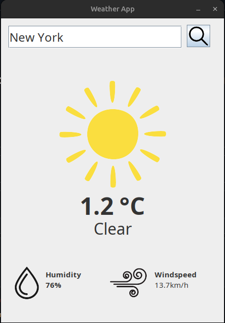
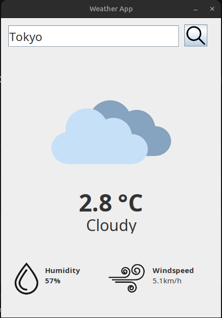

# ☁️ Weather App


Aplicação desktop em Java que permite consultar informações meteorológicas em tempo real de qualquer localidade do mundo, utilizando as APIs gratuitas da Open-Meteo.

## 📋 Índice

- [Sobre o Projeto](#sobre-o-projeto)
- [Funcionalidades](#funcionalidades)
- [Tecnologias Utilizadas](#tecnologias-utilizadas)
- [Pré-requisitos](#pré-requisitos)
- [Instalação](#instalação)
- [Como Usar](#como-usar)
- [Estrutura do Projeto](#estrutura-do-projeto)
- [APIs Utilizadas](#apis-utilizadas)
- [Como Funciona](#como-funciona)
- [Troubleshooting](#troubleshooting)

---

## 🌟 Sobre o Projeto

O **Weather App** é uma aplicação desktop desenvolvida em Java com interface gráfica Swing que permite aos usuários consultar condições meteorológicas atuais de qualquer cidade do mundo. O aplicativo exibe temperatura, condição climática, umidade e velocidade do vento em tempo real.

### Capturas de Tela

| Busca - New York | Busca - Tokyo |
|----------------|-------------------|
|  |  | 

---

## ✨ Funcionalidades

- 🔍 **Busca por localização**: Pesquise por qualquer cidade ou região
- 🌡️ **Temperatura atual**: Visualize a temperatura em Celsius
- 🌤️ **Condição climática**: Informação visual da condição do tempo (Limpo, Nublado, Chuvoso, Nevando)
- 💧 **Umidade relativa**: Percentual de umidade do ar
- 💨 **Velocidade do vento**: Medição em km/h
- 🖼️ **Interface visual**: Ícones representativos para cada condição climática
- 🌐 **Cobertura global**: Funciona para qualquer localidade do mundo

---

## 🛠️ Tecnologias Utilizadas

### Core
- **Java 25** - Linguagem de programação
- **Swing** - Framework para interface gráfica
- **Maven** - Gerenciador de dependências e build

### Dependências
```xml
- json-simple 1.1.1 - Parse de JSON
- gson 2.10.1 - Manipulação de objetos JSON
- JUnit 3.8.1 - Testes unitários
```

### APIs Externas
- **Open-Meteo Geocoding API** - Conversão de nome de cidade para coordenadas
- **Open-Meteo Weather Forecast API** - Dados meteorológicos em tempo real

---

## 📦 Pré-requisitos

Antes de começar, certifique-se de ter instalado em sua máquina:

### Obrigatórios
- ☕ **Java JDK 21 ou superior**
  - [Download JDK](https://www.oracle.com/java/technologies/downloads/)
  - Verifique: `java -version`

- 📦 **Apache Maven 3.6+**
  - [Download Maven](https://maven.apache.org/download.cgi)
  - Verifique: `mvn -version`

### Opcionais
- 💻 **IDE Java** (IntelliJ IDEA, Eclipse, VS Code com Java Extension Pack)
- 🌐 **Conexão com Internet** (necessária para consultar as APIs)

---

## 🚀 Instalação

### Passo 1: Clonar o Repositório

```bash
git clone https://github.com/seu-usuario/weather-app.git
cd weather-app
```

### Passo 2: Verificar Estrutura de Arquivos

Certifique-se de que a pasta `src/assets/` contém todos os ícones necessários:

```
src/assets/
├── clear.png       # Ícone de tempo limpo
├── cloudy.png      # Ícone de tempo nublado
├── rain.png        # Ícone de chuva
├── snow.png        # Ícone de neve
├── humidity.png    # Ícone de umidade
├── windspeed.png   # Ícone de vento
└── search.png      # Ícone de busca
```

> ⚠️ **Importante**: Se os ícones estiverem faltando, a aplicação não exibirá as imagens corretamente.

### Passo 3: Instalar Dependências

```bash
mvn clean install
```

Este comando irá:
- Baixar todas as dependências do projeto
- Compilar o código fonte
- Executar os testes
- Gerar o arquivo `.jar` executável

### Passo 4: Compilar o Projeto

```bash
mvn clean package
```

O arquivo JAR será gerado em: `target/weather-app-1.0-SNAPSHOT.jar`

---

## 🎮 Como Usar

### Método 1: Executar via Maven (Recomendado)

```bash
mvn exec:java -Dexec.mainClass="org.example.AppLauncher"
```

### Método 2: Executar o JAR diretamente

```bash
java -jar target/weather-app-1.0-SNAPSHOT.jar
```

### Método 3: Executar via IDE

1. Abra o projeto na sua IDE
2. Localize a classe `AppLauncher.java`
3. Execute o método `main()`

---

## 📖 Guia de Uso da Aplicação

### 1️⃣ Pesquisar uma Localização

1. Digite o nome de uma cidade no campo de busca
   - Exemplos: `Tokyo`, `São Paulo`, `New York`, `London`
2. Clique no botão de busca (ícone de lupa) ou pressione Enter

### 2️⃣ Visualizar Informações

A aplicação exibirá:
- **Ícone da condição climática** (sol, nuvens, chuva ou neve)
- **Temperatura atual** em Celsius
- **Descrição da condição** (Clear, Cloudy, Rainy, Snowy)
- **Umidade relativa** em percentual
- **Velocidade do vento** em km/h

### 3️⃣ Pesquisar Outro Local

Basta digitar um novo nome de cidade e pesquisar novamente!

---

## 📁 Estrutura do Projeto

```
weather-app/
├── src/
│   ├── main/
│   │   ├── java/
│   │   │   └── org/
│   │   │       └── example/
│   │   │           ├── AppLauncher.java          # Classe principal
│   │   │           ├── WeatherAppGui.java        # Interface gráfica
│   │   │           └── WeatherAppNew.java        # Lógica da API
│   │   └── resources/
│   ├── assets/                                    # Recursos visuais
│   │   ├── clear.png
│   │   ├── cloudy.png
│   │   ├── rain.png
│   │   ├── snow.png
│   │   ├── humidity.png
│   │   ├── windspeed.png
│   │   └── search.png
│   └── test/
│       └── java/
│           └── org/
│               └── example/
│                   └── AppTest.java               # Testes unitários
├── docs/
│   └── images/                                    # Screenshots da aplicação
│       ├── app-screenshot.png
│       ├── home.png
│       └── result.png
├── pom.xml                                        # Configuração Maven
└── README.md                                      # Esta documentação
```

---

## 🌐 APIs Utilizadas

### 1. Open-Meteo Geocoding API

**Propósito**: Converter nome de cidade em coordenadas geográficas (latitude/longitude)

**Endpoint**: 
```
https://geocoding-api.open-meteo.com/v1/search?name={CIDADE}&count=10&language=pt&format=json
```

**Exemplo de Resposta**:
```json
{
  "results": [
    {
      "name": "Tokyo",
      "latitude": 35.6895,
      "longitude": 139.69171
    }
  ]
}
```

### 2. Open-Meteo Weather Forecast API

**Propósito**: Obter dados meteorológicos para coordenadas específicas

**Endpoint**:
```
https://api.open-meteo.com/v1/forecast?latitude={LAT}&longitude={LON}&hourly=temperature_2m,weather_code,relative_humidity_2m,wind_speed_10m&timezone=America/Sao_Paulo
```

**Exemplo de Resposta**:
```json
{
  "hourly": {
    "time": ["2026-01-06T00:00", "2026-01-06T01:00", ...],
    "temperature_2m": [23.5, 22.8, ...],
    "weather_code": [0, 1, ...],
    "relative_humidity_2m": [65, 68, ...],
    "wind_speed_10m": [12.5, 11.3, ...]
  }
}
```

**Weather Codes**:
- `0` = Clear (Limpo)
- `1-3` = Cloudy (Nublado)
- `51-67, 80-99` = Rainy (Chuvoso)
- `71-77` = Snowy (Nevando)

---

## ⚙️ Como Funciona

### Fluxo de Dados

```
┌──────────────┐
│   Usuário    │
│ digita cidade│
└──────┬───────┘
       │
       ▼
┌──────────────────┐
│  WeatherAppGui   │ ← Interface Swing
│   (searchButton) │
└──────┬───────────┘
       │
       ▼
┌──────────────────────┐
│  WeatherAppNew       │
│  getLocationData()   │ ───► Geocoding API
└──────┬───────────────┘      (nome → coordenadas)
       │
       │ latitude, longitude
       │
       ▼
┌──────────────────────┐
│  WeatherAppNew       │
│  getWeatherData()    │ ───► Weather API
└──────┬───────────────┘      (coordenadas → clima)
       │
       │ temperatura, condição, umidade, vento
       │
       ▼
┌──────────────────┐
│  WeatherAppGui   │
│  (atualiza UI)   │ ◄── Exibe dados formatados
└──────────────────┘
```

### Principais Classes

#### 1. `AppLauncher.java`
- **Responsabilidade**: Inicializar a aplicação
- **Método principal**: `main()` - Cria a thread Swing e exibe a GUI

#### 2. `WeatherAppGui.java`
- **Responsabilidade**: Interface gráfica e interação com usuário
- **Componentes**:
  - Campo de texto para busca
  - Botão de busca
  - Labels para exibir dados
  - Imagens/ícones
- **Eventos**: ActionListener no botão de busca

#### 3. `WeatherAppNew.java`
- **Responsabilidade**: Lógica de negócio e comunicação com APIs
- **Métodos principais**:
  - `getLocationData()` - Busca coordenadas
  - `getWeatherData()` - Busca dados climáticos
  - `fetchApiResponse()` - Faz requisições HTTP
  - `convertWeatherCode()` - Converte códigos em texto
  - `getCurrentTime()` - Obtém horário atual formatado

---

## 🔧 Troubleshooting

### Problema: Imagens não aparecem

**Solução**:
1. Verifique se a pasta `src/assets/` existe
2. Confirme que todos os arquivos PNG estão presentes
3. Verifique os caminhos no código (devem ser relativos)

### Problema: Erro ao conectar com API

**Sintomas**: `Error: could not connect to API`

**Soluções**:
- Verifique sua conexão com internet
- Confirme se as URLs das APIs estão corretas
- Teste as APIs diretamente no navegador

### Problema: Localização não encontrada

**Sintomas**: Nada acontece ao pesquisar

**Soluções**:
- Digite nomes de cidades conhecidas
- Use nomes em inglês para melhores resultados
- Tente adicionar o país: `Paris, France`

### Problema: Maven não encontrado

**Sintomas**: `mvn: command not found`

**Soluções**:
1. Instale o Maven: [Guia de Instalação](https://maven.apache.org/install.html)
2. Adicione Maven ao PATH do sistema
3. Reinicie o terminal

### Problema: Java não encontrado

**Sintomas**: `java: command not found`

**Soluções**:
1. Instale o JDK: [Download](https://www.oracle.com/java/technologies/downloads/)
2. Configure a variável `JAVA_HOME`
3. Adicione ao PATH

---

## 📝 Notas Adicionais

### Limitações Conhecidas
- Requer conexão ativa com internet
- Depende da disponibilidade das APIs Open-Meteo
- Interface em inglês (temperatura e condições)

### Melhorias Futuras
- [ ] Internacionalização (i18n)
- [ ] Histórico de buscas
- [ ] Previsão para múltiplos dias
- [ ] Temas claro/escuro
- [ ] Cache de resultados
- [ ] Favoritos de localizações

---

## 📄 Licença

Este projeto está sob a licença MIT. Veja o arquivo `LICENSE` para mais detalhes.

---

## 👨‍💻 Autor

Desenvolvido com ☕ e ❤️

---

## 🙏 Agradecimentos

- [Open-Meteo](https://open-meteo.com/) - APIs gratuitas e confiáveis
- [Oracle](https://www.oracle.com/java/) - Java Development Kit
- [Apache Maven](https://maven.apache.org/) - Gerenciamento de dependências

---

## 📞 Suporte

Se encontrar problemas ou tiver dúvidas:
1. Verifique a seção [Troubleshooting](#troubleshooting)
2. Abra uma issue no repositório
3. Entre em contato com o desenvolvedor

---

**⭐ Se este projeto foi útil, considere dar uma estrela no GitHub!**
